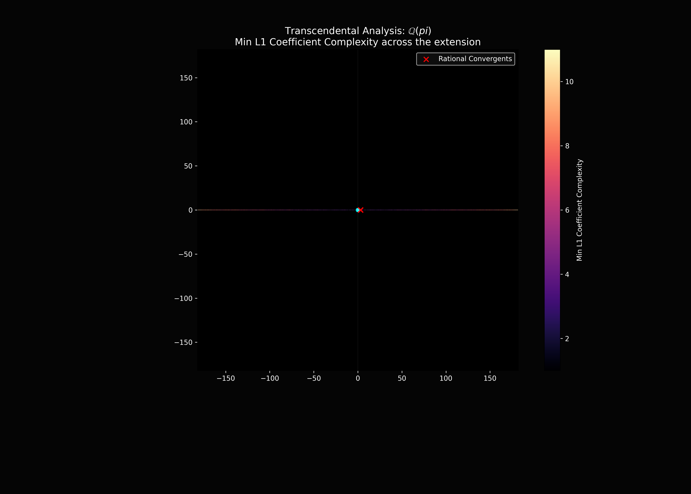
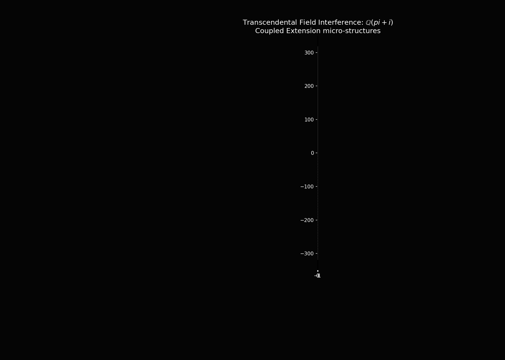
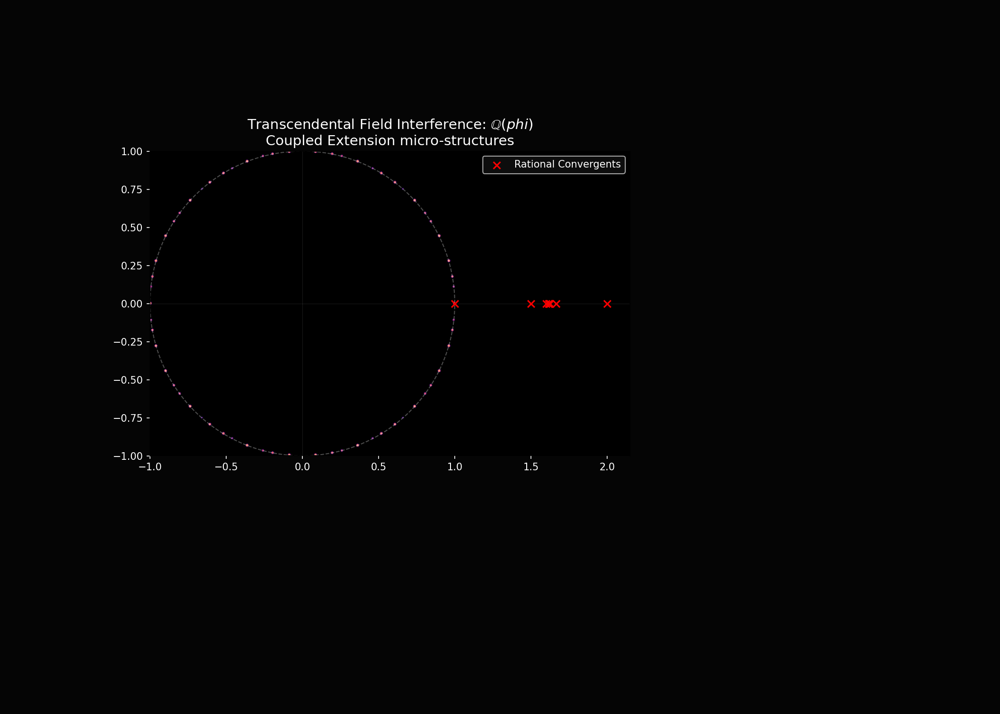
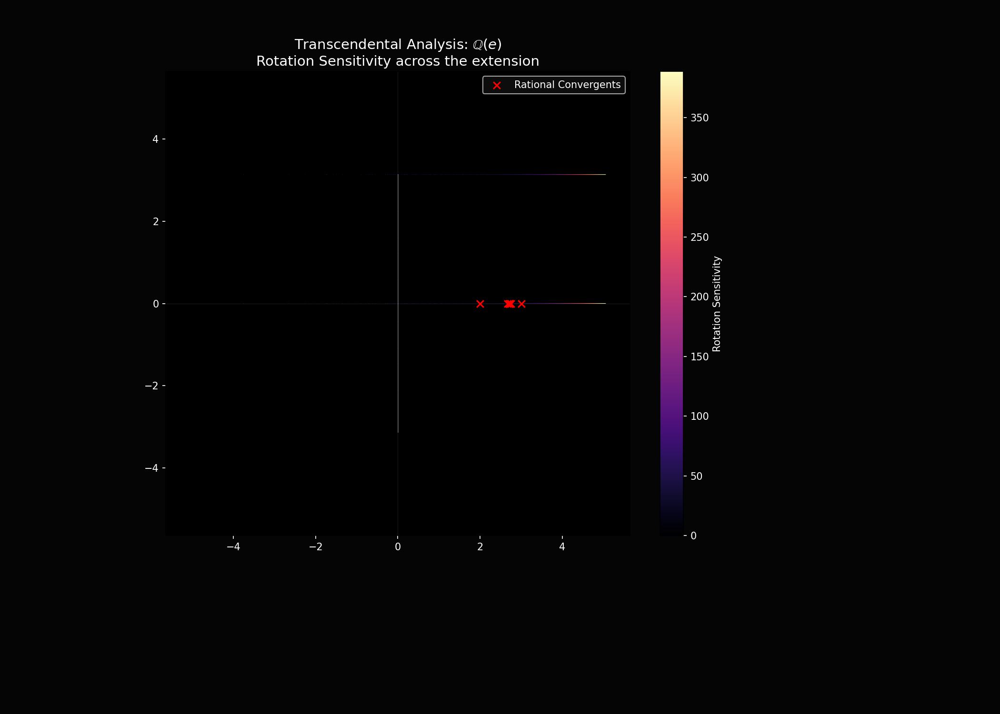
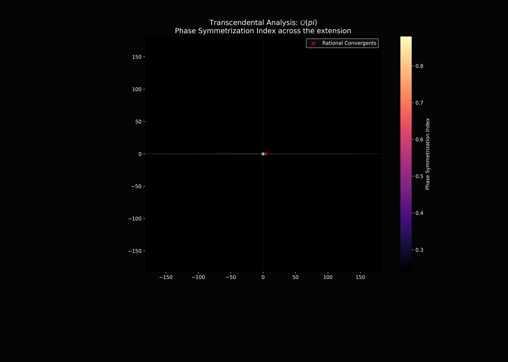
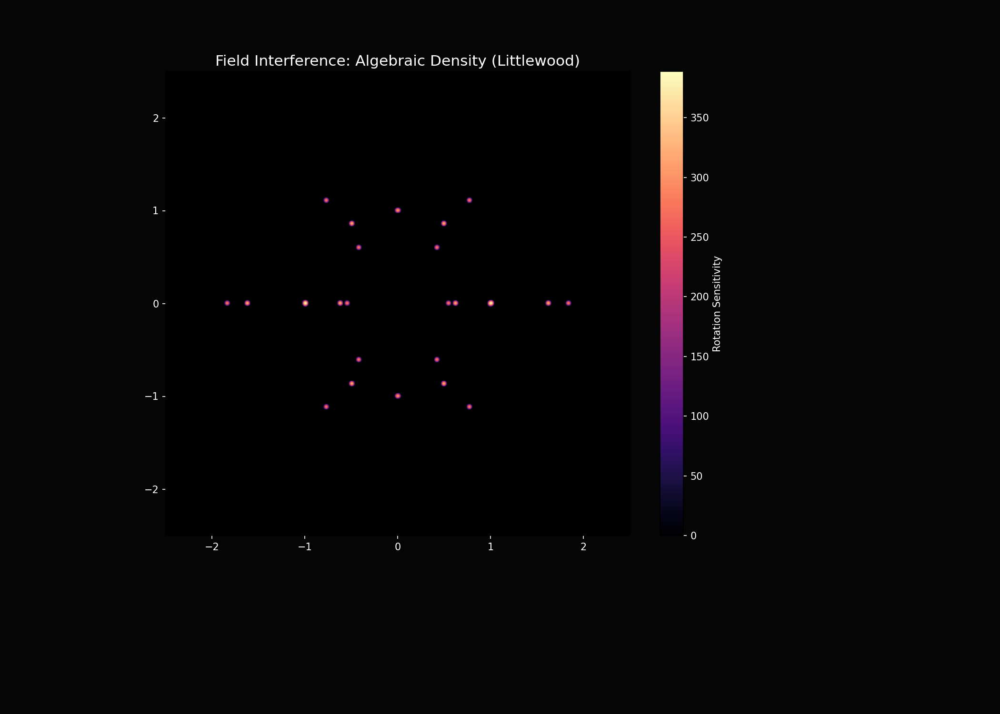

# Field Interference Explorers

A collection of interactive and high-performance tools for exploring the structural density and "interference" patterns of various field systems: Algebraic numbers, Finite fields, and Transcendental extensions.

## Project Overview

This repository provides a suite of visualizers that bridge the gap between abstract field theory and numerical computation. By visualizing the roots of random polynomials, the cyclic orbits of finite field generators, and the dense embeddings of transcendental extensions, we can observe the emergent geometric patterns that characterize different algebraic structures.

---

## 1. Educational Galois Demos (`demo1/`)

Pedagogical examples designed to illustrate core algebraic concepts.

### Finite Field Interference (`demo01.cpp`)
Visualizes the interplay between the **additive vector space** structure of $GF(p^n)$ (the lattice) and its **multiplicative cyclic group** (the generator orbit).

- **Irreducible Search**: Automatically finds valid irreducible polynomials for extension degrees 1-5 using a rigorous GCD-based test.
- **Generator Orbit**: Traces the cyclic multiplicative structure with color gradients using mathematically correct polynomial reduction.

### Grothendieck Viewpoint (`demo02.cpp`)
Illustrates how functions defined on polynomial quotient rings $GF(p)[x]/(g)$ are essentially functions restricted to the variety $V(g)$.

### Companion Matrices & Field Extensions (`demo03.cpp`)
Demonstrates the relationship between algebraic field extensions $Q(\alpha)$, companion matrices, and their roots (eigenvalues) in the complex plane.

---

## 2. High-Performance Explorers (`interference/`)

Advanced C++ implementations using FLTK and OpenGL for deep visualization of large-scale algebraic data.

### Root Density Heatmaps (`demo07/`)
Features high-performance OpenGL texture rendering for root-density heatmaps, allowing smooth real-time panning and zooming into the fractal-like structures of algebraic numbers.

- **Rational Resonance**: Highlights roots that are near rational convergents of their real components, exposing constructive interference zones.
- **Hardware Acceleration**: Uses OpenGL textures for fluid interactive exploration.

### Professional 3D Explorer (`demo0c/`)
Visualizes field structures in 3D, including "Basis Towers" for extensions, a Riemann Sphere projection, and Torus mapping.

---

## 3. Python Analysis Tools

### Unified Field Explorer (`field_interference_unified.py`)
A versatile tool for generating high-resolution distributions of algebraic numbers and visualizing finite field lattice connections and multiplicative orbits.

### Transcendental Field Explorer (`transcendental_field_explorer.py`)
Visualizes the resonance of $\mathbb{Q}(\alpha)$ for transcendental $\alpha$ (like $\pi$, $e$, or $\zeta(3)$), exploring how these extensions form dense subfields that "interfere" with the standard complex plane.

- **Vectorized Engine**: High-performance NumPy implementation supporting up to 2 million samples with chunked processing for memory efficiency.
- **Coordinate Mappings**:
    - **Standard**: Standard complex plane.
    - **Log-Polar**: Exposes radial and angular scaling symmetries. 
    - **Reciprocal**: Visualizes the field near the origin and at infinity. 
    - **Joukowsky**: Aerodynamic transformation highlighting conformal symmetries. 
    - **Mobius**: Standard Mobius transformation $(z-1)/(z+1)$. 
    - **Euler Space**: Mapping $z \to \exp(i \pi z / \text{base})$ to expose periodic symmetries. 
- **Advanced Metrics**:
    - **Rational Resonance**: Intensity based on proximity to continued fraction convergents (real) or Lattice anchors (Gaussian/Eisenstein integers). 
    - **Rotation Sensitivity**: Visualizes how field density shifts under infinitesimal base rotations. 
    - **Phase Alignment**: Measures coherence of expansion terms. 
    - **Algebraic Mode**: Now supports 'Binary', 'Littlewood', and 'Standard' coefficient sets. 
- **Custom Bases**: Supports arbitrary complex expressions including `gamma` and `zeta` functions with extended `_safe_eval`.
- **Export**: High-resolution PNG images and JSON raw data export for further numerical analysis.

---

## Requirements

### C++ Explorers
- **FLTK 1.3+**, **OpenGL / GLU**
- **Build**: `g++ -std=c++17 -O3 <file>.cpp -o explorer -lfltk -lfltk_gl -lGL -lGLU -lm`

### Python Tools
- `numpy`, `matplotlib`, `scipy`

## Usage Instructions

1. **Navigate** to a demo directory (e.g., `interference/demo07`).
2. **Build** the executable or run the Python tool.
3. **Interact**: Use side panels for parameter tuning. In 3D: Left-click (Pan), Right-click (Rotate), Scroll (Zoom).
