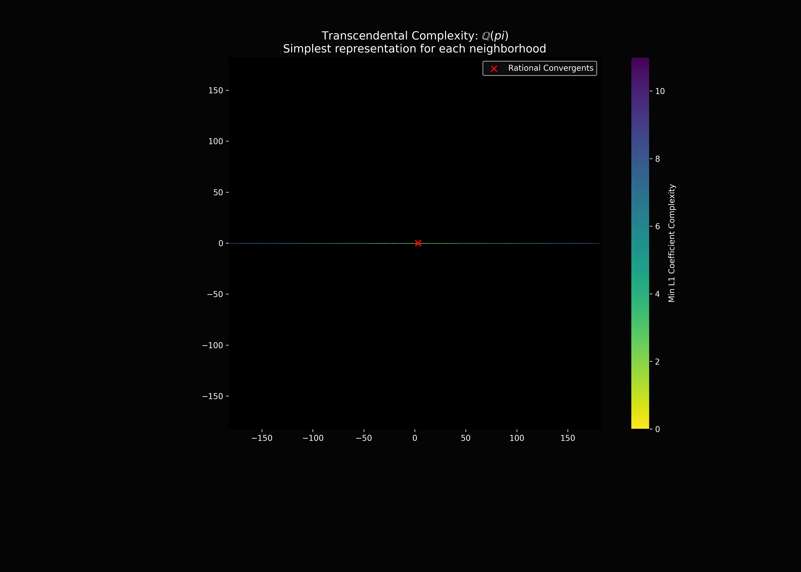

# Field Interference Explorers

A collection of interactive and high-performance tools for exploring the structural density and "interference" patterns of various field systems: Algebraic numbers, Finite fields, and Transcendental extensions.

## Project Overview

This repository provides a suite of visualizers that bridge the gap between abstract field theory and numerical computation. By visualizing the roots of random polynomials, the cyclic orbits of finite field generators, and the dense embeddings of transcendental extensions, we can observe the emergent geometric patterns that characterize different algebraic structures.

---

## 1. Educational Galois Demos (`demo1/`)

Pedagogical examples designed to illustrate core algebraic concepts.

### Finite Field Interference (`demo01.cpp`)
Visualizes the interplay between the **additive vector space** structure of $GF(p^n)$ (the lattice) and its **multiplicative cyclic group** (the generator orbit).

- **Key Concept**: Every finite field $GF(q)$ is a vector space over its prime subfield $GF(p)$. Simultaneously, its non-zero elements form a cyclic group under multiplication.
- **Visualization**: Blue lines show the additive neighbors (distance 1 in the basis), while the yellow path traces the orbit of a primitive element $\alpha$.

### Companion Matrices & Field Extensions (`demo03.cpp`)
Demonstrates the relationship between algebraic field extensions $Q(\alpha)$, companion matrices, and their roots (eigenvalues) in the complex plane.

- **Key Concept**: The companion matrix of a polynomial $P(x)$ has eigenvalues exactly equal to the roots of $P(x)$. This links linear algebra directly to field theory.
- **Visualization**: Left side shows the roots in $\mathbb{C}$. Right side shows the structure of the companion matrix $M$.

---

## 2. High-Performance Explorers (`interference/`)

Advanced C++ implementations using FLTK and OpenGL for deep visualization of large-scale algebraic data.

### Root Density Heatmaps (`demo07/`)
Features high-performance OpenGL texture rendering for root-density heatmaps, allowing smooth real-time panning and zooming into the fractal-like structures of algebraic numbers.

- **Key Concept**: The distribution of roots of random polynomials with restricted coefficients (e.g., Littlewood polynomials) reveals intense "interference" patterns, particularly near the unit circle.
- **Visualization**: Magma-colored heatmaps showing where roots cluster in the complex plane.

---

## 3. Python Analysis Tools

### Unified Field Explorer (`field_interference_unified.py`)
A versatile tool for generating high-resolution distributions of algebraic numbers and visualizing finite field lattice connections.

### Transcendental Field Explorer (`transcendental_field_explorer.py`)
Visualizes the resonance of $\mathbb{Q}(\alpha)$ for transcendental $\alpha$ (like $\pi$ or $e$), exploring how these extensions form dense subfields that "interfere" with the standard complex plane.

- **Vectorized Engine**: High-performance NumPy implementation capable of simulating millions of elements in real-time.
- **Custom Bases**: Supports arbitrary complex bases and mathematical expressions (e.g., `exp(1j*pi/4)`).
- **Complexity Analysis**: Visualizes the "simplest" representation of field elements using L1-coefficient complexity heatmaps.
- **Rational Convergents**: Overlays continued fraction convergents to show the rational skeleton of the extension.

---

## Requirements

### C++ Explorers
- **FLTK 1.3+**: GUI framework.
- **OpenGL / GLU**: Hardware-accelerated rendering.
- **Build**: `g++ -std=c++17 -O3 <file>.cpp -o explorer -lfltk -lfltk_gl -lGL -lGLU -lm`

### Python Tools
- `numpy`, `matplotlib`, `scipy`, `sympy`

## Usage Instructions

1. **Navigate** to a demo directory (e.g., `interference/demo07`).
2. **Build** the executable using the provided build command or `compile_interference.sh`.
3. **Run** the explorer. Use the side panel to adjust parameters like polynomial degree, coefficient range, or field prime $p$.
4. **Interact**: Left-click to pan, scroll or right-click to zoom.
