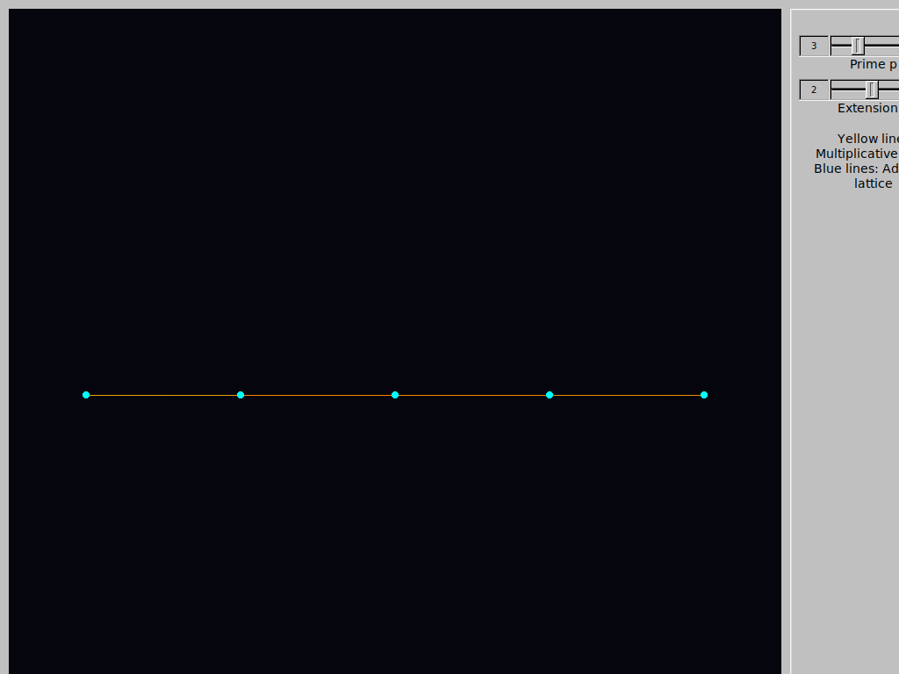
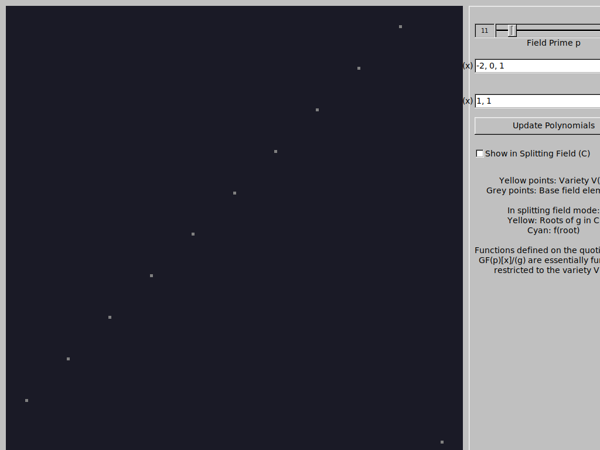
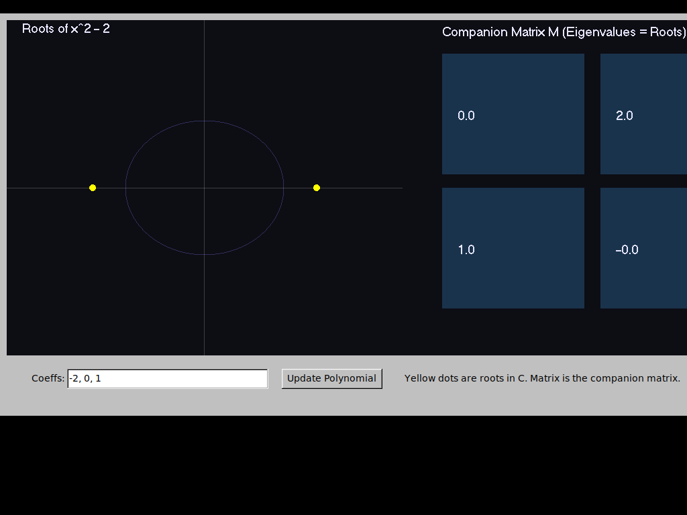
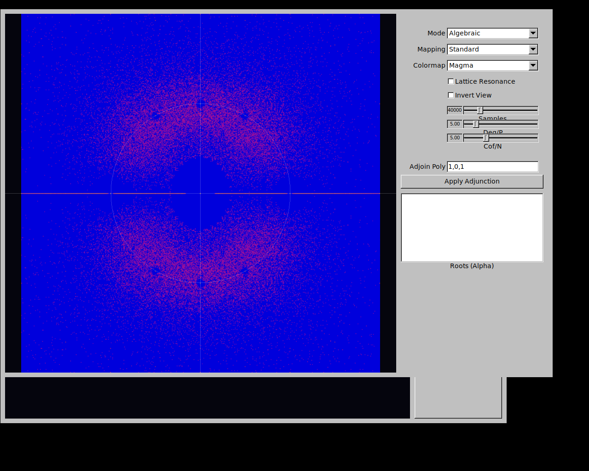
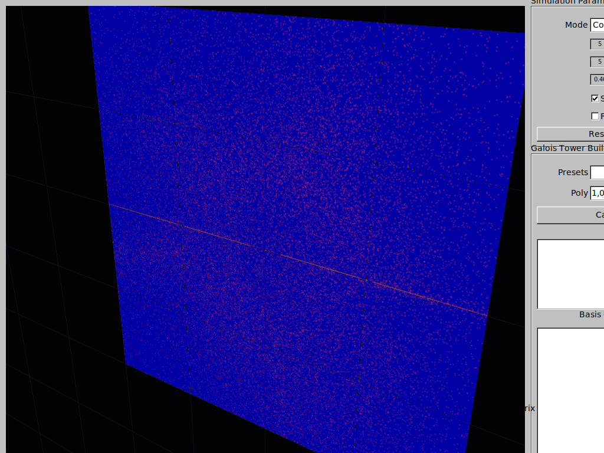
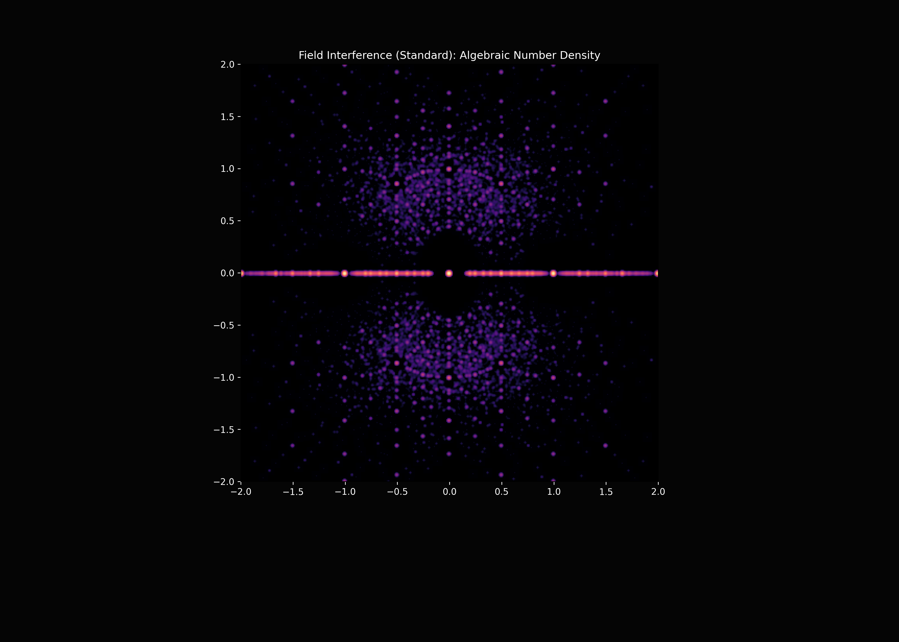
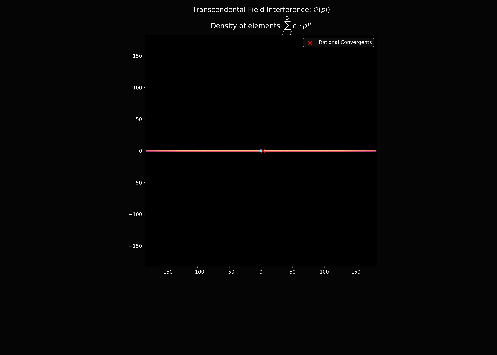
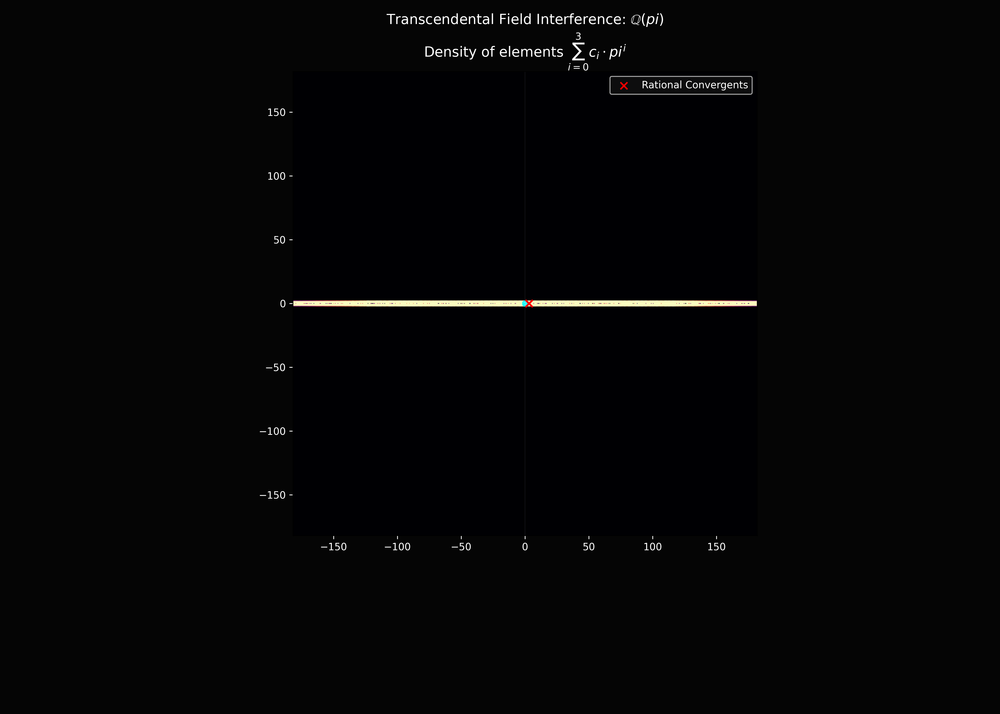
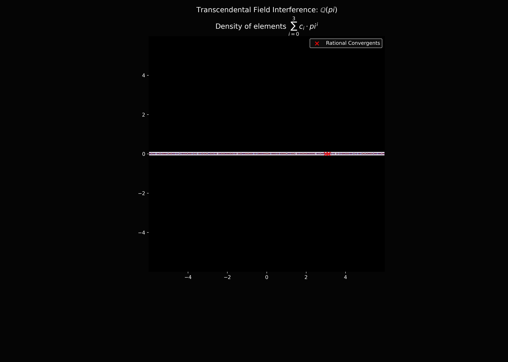
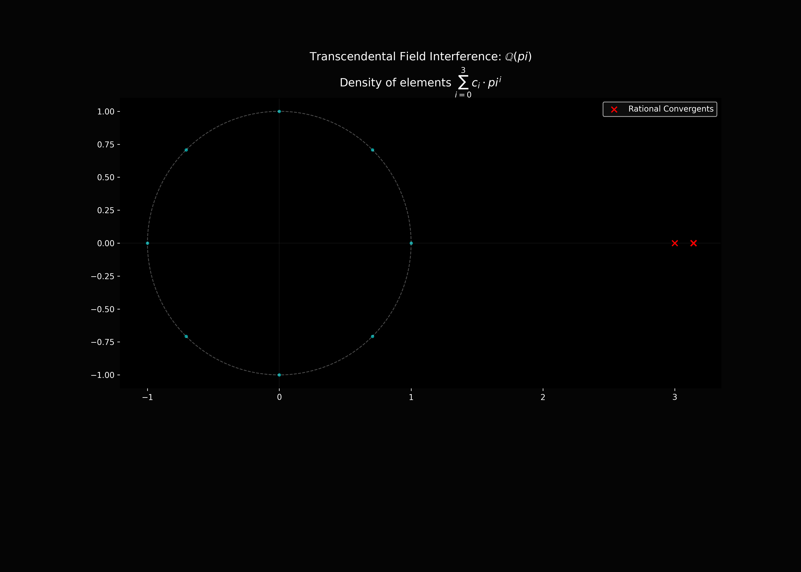

# Field Interference Explorers

A collection of interactive and high-performance tools for exploring the structural density and "interference" patterns of various field systems: Algebraic numbers, Finite fields, and Transcendental extensions.

## Project Overview

This repository provides a suite of visualizers that bridge the gap between abstract field theory and numerical computation. By visualizing the roots of random polynomials, the cyclic orbits of finite field generators, and the dense embeddings of transcendental extensions, we can observe the emergent geometric patterns that characterize different algebraic structures.

---

## 1. Educational Galois Demos (`demo1/`)

Pedagogical examples designed to illustrate core algebraic concepts.

### Finite Field Interference (`demo01.cpp`)
Visualizes the interplay between the **additive vector space** structure of $GF(p^n)$ (the lattice) and its **multiplicative cyclic group** (the generator orbit).

- **Irreducible Search**: Automatically finds valid irreducible polynomials for extension degrees 1-4.
- **Generator Orbit**: Traces the cyclic multiplicative structure with color gradients.
- **Key Concept**: Every finite field $GF(q)$ is a vector space over its prime subfield $GF(p)$. Simultaneously, its non-zero elements form a cyclic group under multiplication.

### Grothendieck Viewpoint (`demo02.cpp`)
Illustrates how functions defined on polynomial quotient rings $GF(p)[x]/(g)$ are essentially functions restricted to the variety $V(g)$.

- **Splitting Field Mode**: Approximates roots in $\mathbb{C}$ to show how the function $f$ evaluates at the variety's points.
- **Quotient Mapping**: Visualizes the "descent" of algebraic functions to geometric varieties.

### Companion Matrices & Field Extensions (`demo03.cpp`)
Demonstrates the relationship between algebraic field extensions $Q(\alpha)$, companion matrices, and their roots (eigenvalues) in the complex plane.

- **Eigenvalue Equivalence**: Explicitly lists computed eigenvalues next to the companion matrix structure.
- **Visualization**: Left side shows the roots in $\mathbb{C}$. Right side shows the companion matrix $M$, where eigenvalues = roots.

---

## 2. High-Performance Explorers (`interference/`)

Advanced C++ implementations using FLTK and OpenGL for deep visualization of large-scale algebraic data.

### Root Density Heatmaps (`demo07/`)
Features high-performance OpenGL texture rendering for root-density heatmaps, allowing smooth real-time panning and zooming into the fractal-like structures of algebraic numbers.

- **Hardware Acceleration**: Uses OpenGL textures for fluid interactive exploration.
- **Algebraic Interference**: Visualizes the density of roots for random Littlewood polynomials.

### Professional 3D Explorer (`demo0c/`)
Visualizes field structures in 3D, including "Basis Towers" for extensions and a Riemann Sphere projection.

- **Riemann Sphere**: Maps the complex plane and its field extensions onto a unit sphere, exposing symmetries at infinity.
- **Galois Towers**: Plots basis components along the Z-axis to show the hierarchy of extensions.

---

## 3. Python Analysis Tools

### Unified Field Explorer (`field_interference_unified.py`)
A versatile tool for generating high-resolution distributions of algebraic numbers and visualizing finite field lattice connections.

### Transcendental Field Explorer (`transcendental_field_explorer.py`)
Visualizes the resonance of $\mathbb{Q}(\alpha)$ for transcendental $\alpha$ (like $\pi$ or $e$), exploring how these extensions form dense subfields that "interfere" with the standard complex plane.

- **Vectorized Engine**: High-performance NumPy implementation with dynamic binning for real-time micro-structure analysis.
- **Coordinate Mappings**: Supports Standard, Log-Polar, and Reciprocal mappings to expose different symmetries of the extension.
- **Custom Bases & Rotation**: Supports arbitrary complex expressions and real-time base rotation to explore extension variations.
- **Advanced Metrics**: Visualizes "Min Complexity", "Dominant Power Index", and "Mean Coefficient Magnitude".
- **Coefficient Sets**: Choice of 'Standard' (uniform), 'Binary' {0, 1}, or 'Littlewood' {-1, 1} distributions.
- **Analytic Overlays**: Continued fraction convergents and roots of unity to provide structural context.
- **Gradient Mode**: Visualizes the rate of change in density to highlight field boundaries and cluster edges.

---

## Requirements

### C++ Explorers
- **FLTK 1.3+**: GUI framework.
- **OpenGL / GLU**: Hardware-accelerated rendering.
- **Build**: `g++ -std=c++17 -O3 <file>.cpp -o explorer -lfltk -lfltk_gl -lGL -lGLU -lm`

### Python Tools
- `numpy`, `matplotlib`, `scipy`, `sympy`

## Usage Instructions

1. **Navigate** to a demo directory (e.g., `interference/demo07`).
2. **Build** the executable using the provided build command or `compile_interference.sh`.
3. **Run** the explorer. Use the side panel to adjust parameters like polynomial degree, coefficient range, or field prime $p$.
4. **Interact**: Left-click to pan, scroll or right-click to zoom.
