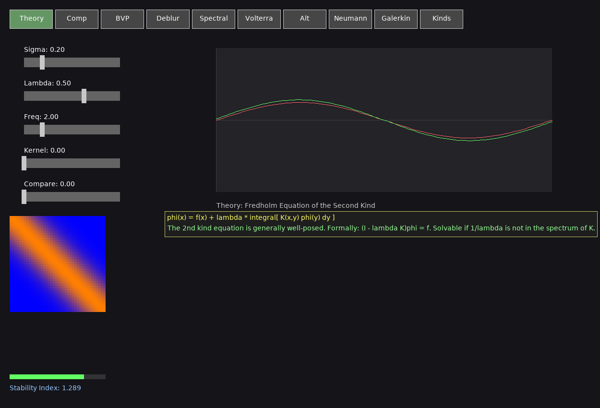
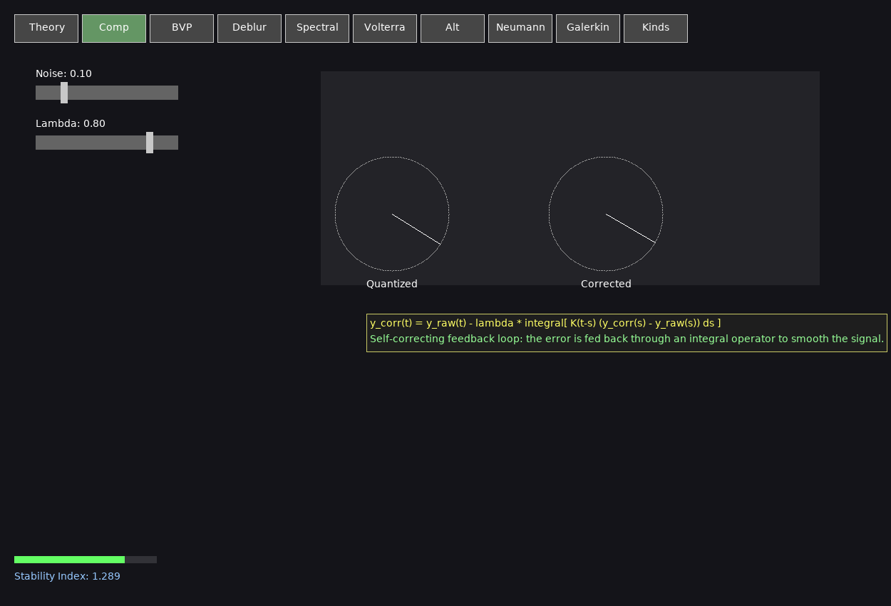
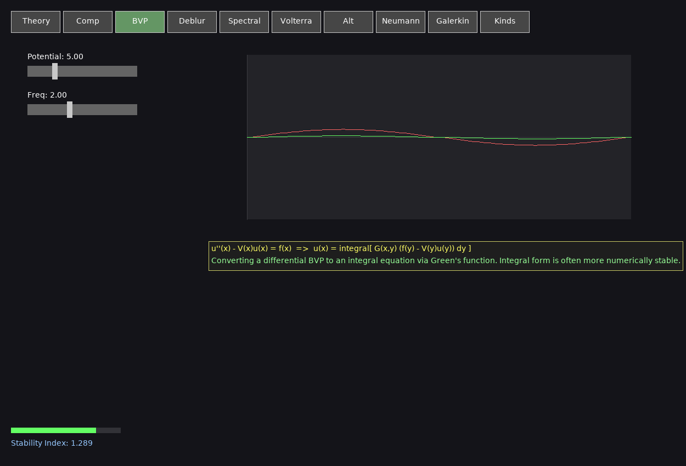
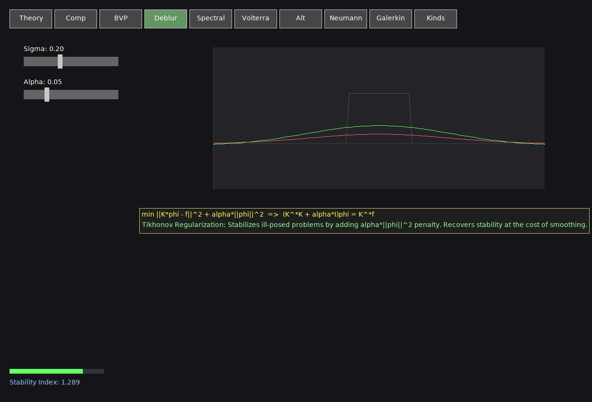
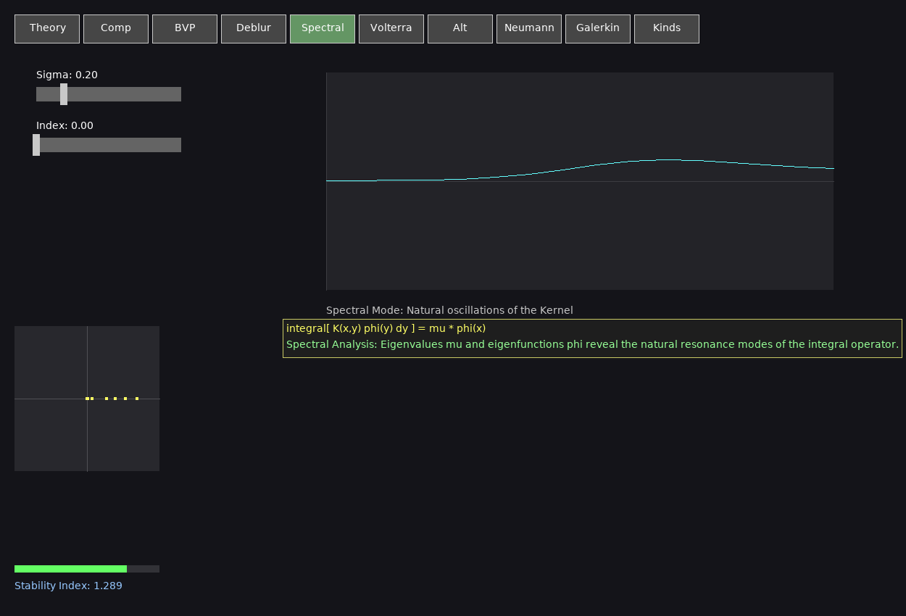
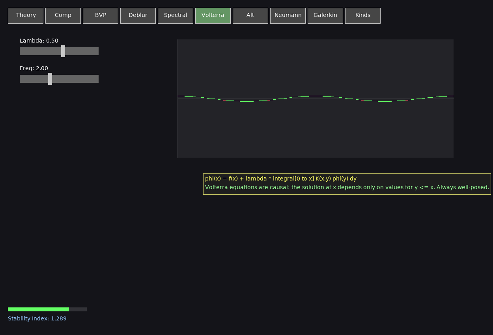
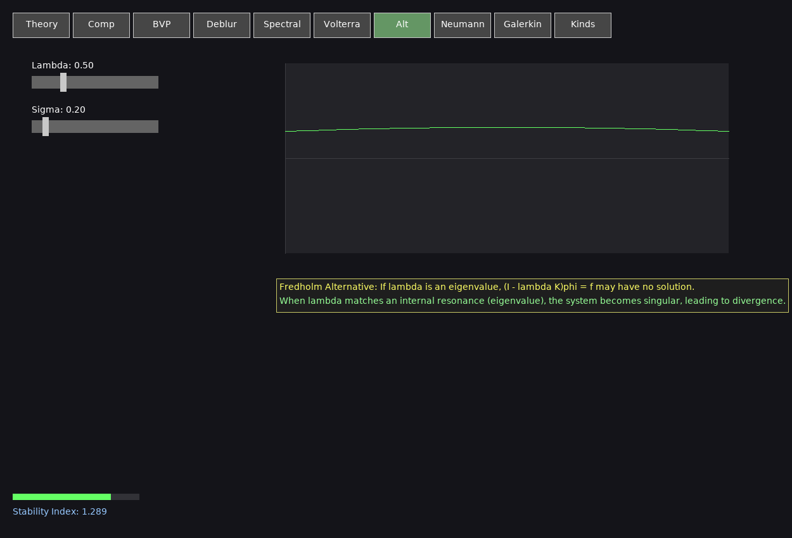
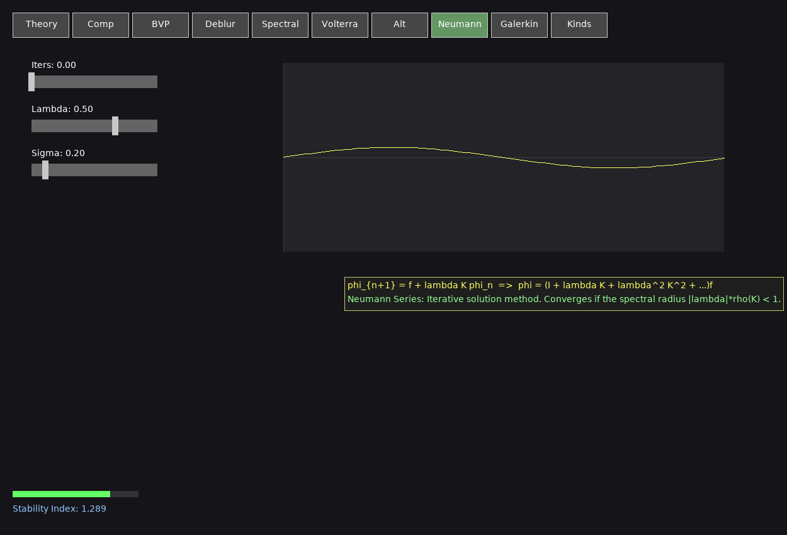
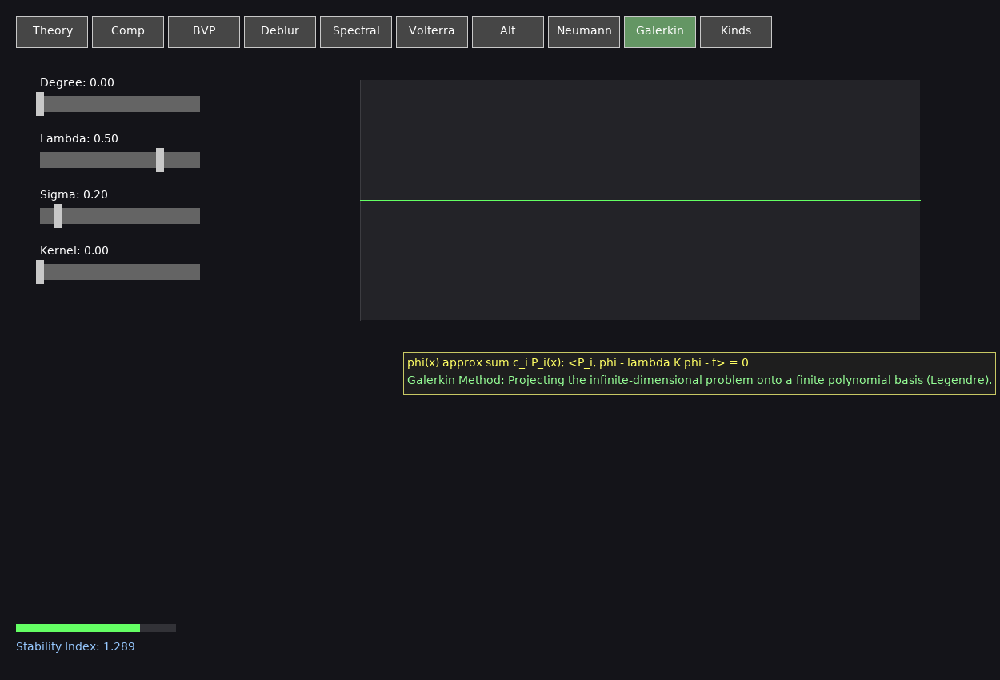
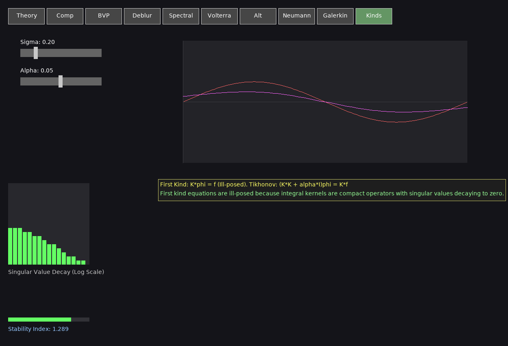

# Fredholm Architect Suite (Research Grade)

A comprehensive numerical engine and interactive visualization suite for Fredholm and Volterra Integral Equations. This tool provides deep visual insights into the behavior of integral operators, spectral decomposition, and regularization of ill-posed problems.

## Visual Tour

### 1. Fredholm Equation of the Second Kind
The fundamental equation $\phi(x) = f(x) + \lambda \int K(x,y)\phi(y)dy$.


### 2. Signal Compensation
Real-time quantization noise and jitter reduction using an adaptive integral feedback loop.


### 3. Boundary Value Problems (BVP)
Solving $u''(x) - V(x)u(x) = f(x)$ by conversion to an integral equation via Green's Functions.


### 4. Tikhonov Deblurring
Restoring a signal from a smoothing (blurring) kernel using Tikhonov Regularization ($L^2$ penalty).


### 5. Spectral Decomposition
Visualization of the operator's eigenfunctions and the distribution of its eigenvalues in the complex plane.


### 6. Volterra Evolution
Modeling causal systems where the state at $t$ depends only on history ($s \le t$). Always well-posed.


### 7. Fredholm Alternative & Resonance
Demonstrating the singularity that occurs when $\lambda$ matches an internal eigenvalue of the kernel.


### 8. Neumann Series Convergence
Visualizing successive approximations $\phi_{n+1} = f + \lambda K \phi_n$. Converges when $|\lambda|\rho(K) < 1$.


### 9. Galerkin Basis Expansion
Solving the equation by projecting it onto a finite-dimensional basis of Legendre Polynomials.


### 10. First-Kind Equations & SVD
Analyzing the inherent ill-posedness of $K\phi = f$ using Singular Value Decomposition (SVD).


## Core Technologies

- **FredholmEngine.h**: Header-only C++17 library.
  - **Quadrature**: 8 and 16-point Gauss-Legendre schemes.
  - **SVD Solver**: Robust Jacobi-rotation implementation with spectral sorting.
  - **BVP Solver**: Integrated Green's function mapping.
  - **Stability**: Real-time Condition Number estimation ($||\sigma_{max} / \sigma_{min}||$).
- **Visuals**: SDL2-accelerated with `TextureCache` for high-performance text rendering and multi-path font search.

## Building and Running

### Prerequisites
- C++17 compiler (g++)
- `libsdl2-dev`, `libsdl2-ttf-dev`

### Build
```bash
g++ fredholm_suite.cpp -o fredholm_suite -lSDL2 -lSDL2_ttf -I .
./fredholm_suite
```

## Interactive Navigation
- **Scroll Wheel**: Zoom into graphs.
- **Right Click + Drag**: Pan vertically.
- **Hover**: View 'Theory Cards', precise $(x, y)$ coordinates, and real-time $K(x,y)$ values by hovering over the heatmap.
- **Stability Gauge**: Monitor system proximity to singularity with the color-coded visual indicator.
- **Sliders**: Real-time parameter tuning ($\lambda$, $\sigma$, $\alpha$).
- **Compare Slider**: In Theory mode, toggle to compare Nystrom vs. Galerkin numerical solutions.
- **Export Data**: Press **'E'** to export the current solution to `fredholm_export.csv`.
